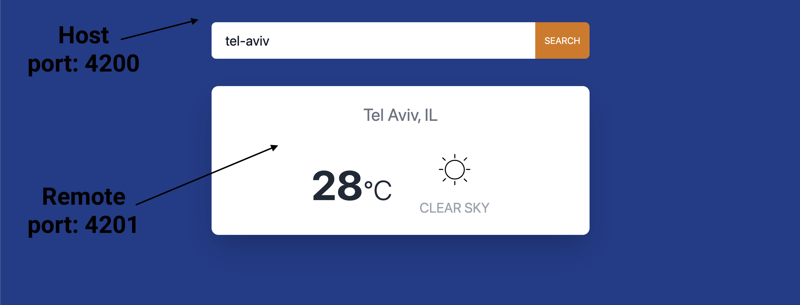

# angular-micro-frontends-weather-example

Weather web application using Angular and Nx with micro frontends.



## How to Run Locally

### Update environment variables

1. Create `.env` file from `env.example` file
2. Update `WEATHER_API_OPEN_WEATHER_MAP_ACCESS_TOKEN` value to access token from [Weather API](https://openweathermap.org)

### Install packages

```shell
npm i
```

### Run in Development mode

```shell
# Will run weather app on localhost:4200 and forecast app on localhost:4201
npm run serve:weather-mfe

# Will run weather api on localhost:3333
npn run serve:weather-api
```

### Run in Production mode

```shell
npm run build:weather-mfe
npm run build:weather-api

# Will run on localhost:3333
npm run run:weather
# Will run on localhost:4200
npm run run:forecast
# Will run on localhost:4201
npm run run:weather-api
```

# License

[MIT](LICENSE)
